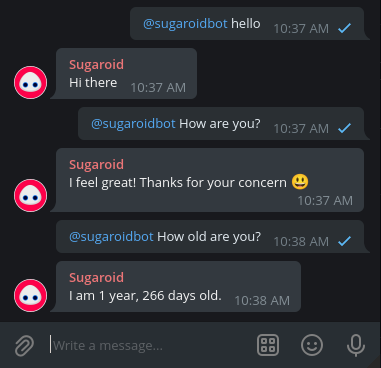

sg-telegram
==========

A thin telegram wrapper built on top of Sugaroid Websocket implementation.



Build 
-----
```bash
go build .
```

Run
----
```bash
export TELEGRAM_BOT_TOKEN="supersecrettoken" 
export SG_TG_COMMAND_PREFIX="@mysugaroidbot "
export SG_TG_CHANNEL_ID_WHITELIST="-13131331313,-43131313"
export SG_TG_WS_ENDPOINT="localhost:3000"
./sg-telegram
```

License
-------
[This project](https://github.com/sugaroidbot/sg-telegram) is 
licensed under the [MIT License](./LICENSE)
